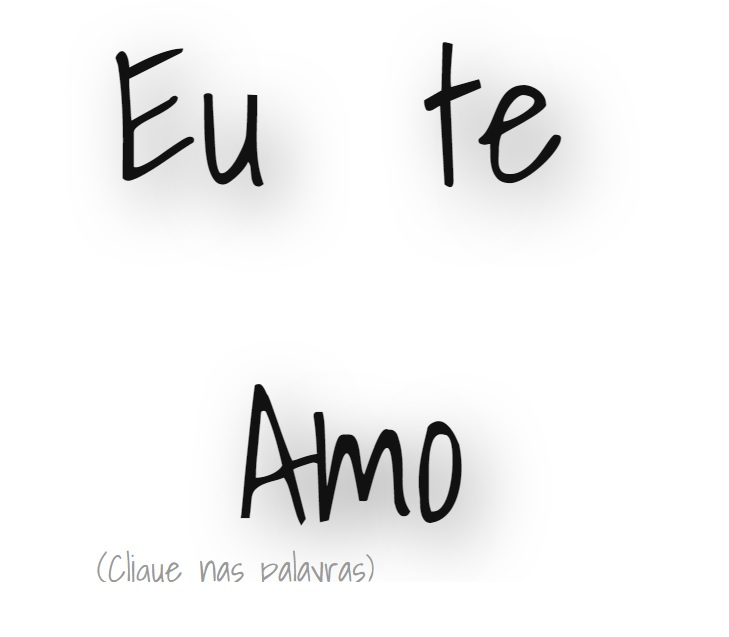
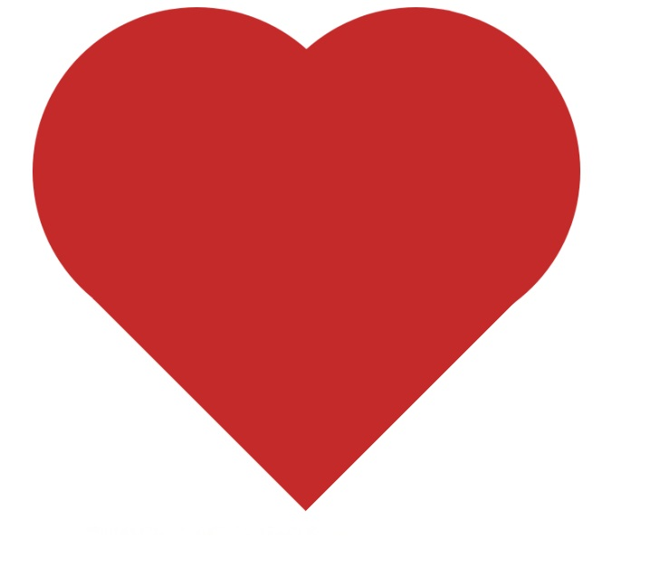

# Projeto Eu te Amo

Este é um projeto simples de animação. O objetivo é criar uma interface onde ao ser clicado, uma animação de pulsação é aplicada a um elemento na página.

### Tecnologias utilizadas:

## Início Rápido
### Pré-requisitos
Para visualizar e testar este projeto, você precisa de um navegador web moderno.

### Passos para Visualização
1. Clone o repositório ou baixe os arquivos diretamente.
2. Certifique-se de que todos os arquivos (index.html, style.css e main.js) estejam no mesmo diretório.
3. Abra o arquivo index.html em um navegador web.

Projeto foi desenvolvido pelo [Ralf Bontrup](https://codepen.io/ralfb)
Utilizei o projeto dele como base para executar o meu. Espero que gostem!